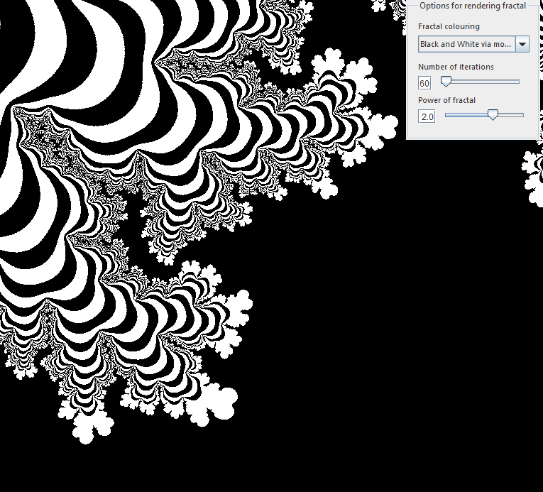
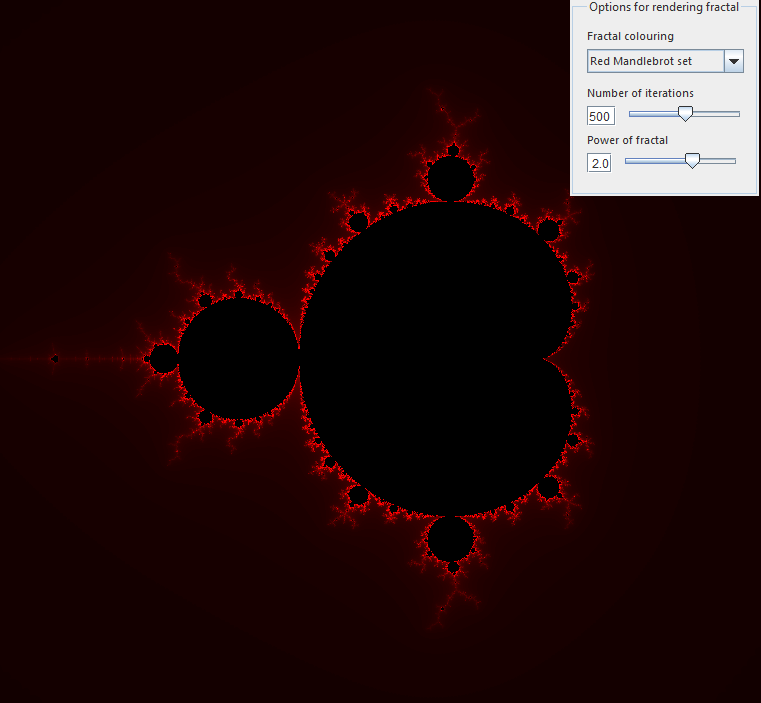

# Fractal Renderer

This project aims to use Java with the Jogl library to render fractals, maven was also used to manage the project.

Currently only the Mandlebrot set is rendered with the aim to render other fractals down the road.

## Execution

To run the application run the following command in the root directory of this project:

"java -jar target\fractal_renderer-1.0-SNAPSHOT-jar-with-dependencies.jar"

## Controls

Click and drag mouse to pan over fractal.

"A" key to zoom in.

"Z" key to zoom out.

## Screenshots

